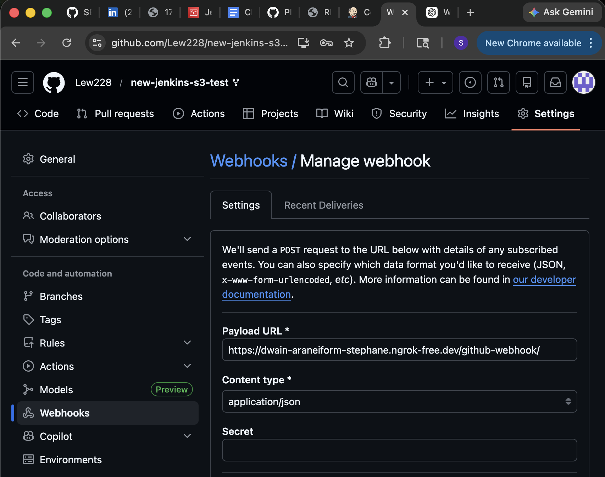
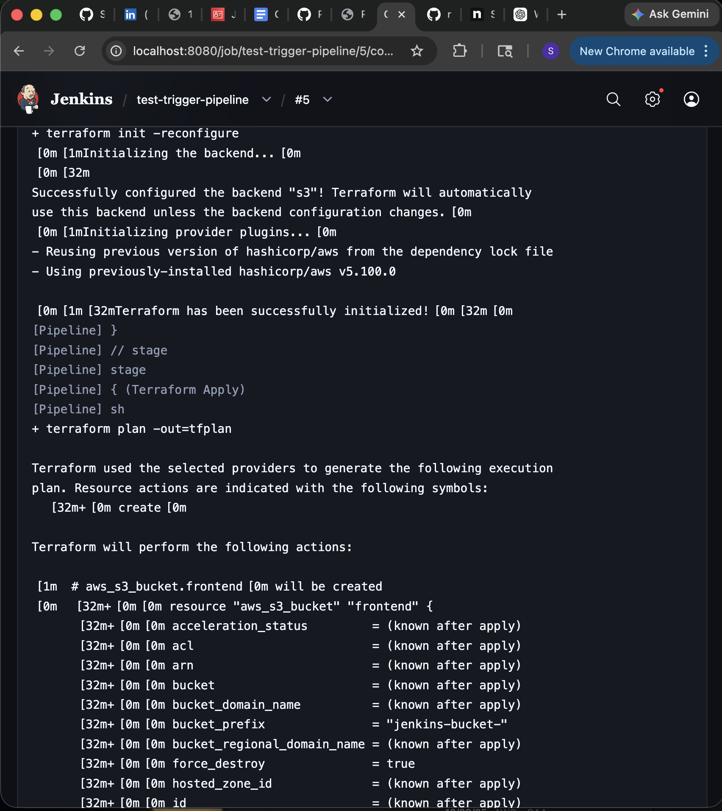
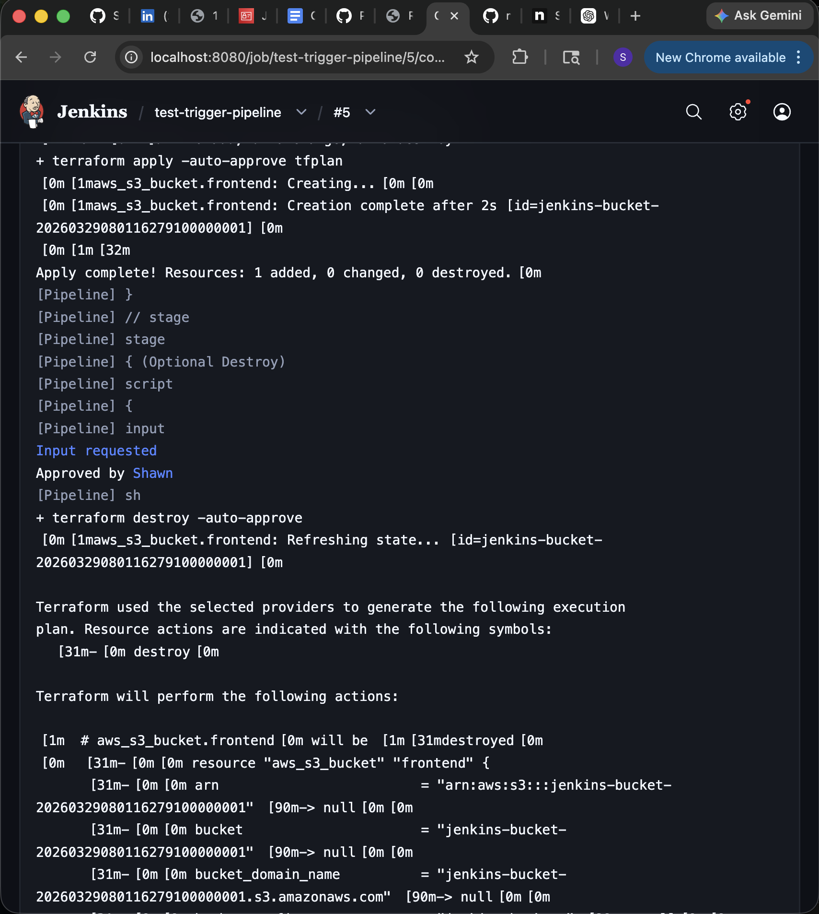
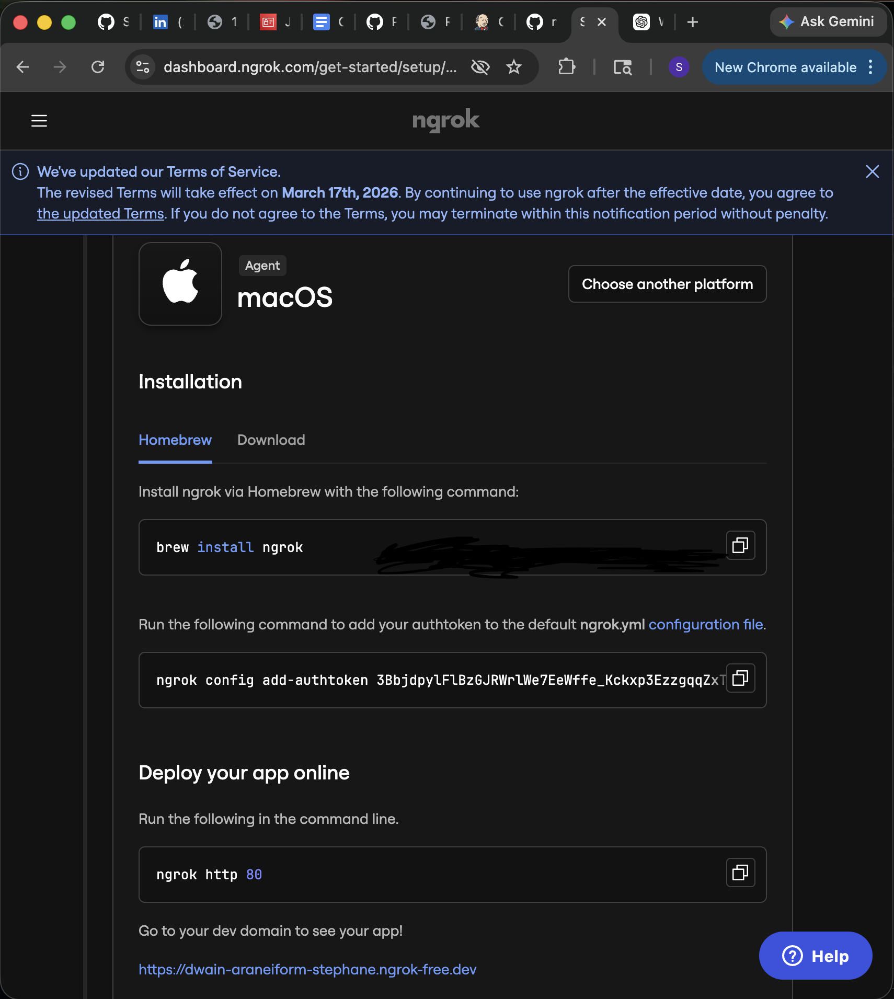

# New Jenkins server test with terraform deployment and triggers

## Jenkinsfile

A simple declarative Jenkinsfile
- Clones git repo 
- Binds AWS IAM user creds in terraform stages with AWS Creds plugin
- Stages for terraform init and apply 
- Destroy stage using user input 

## Terraform script 
- A simple AWS S3 bucket is deployed
- State file is stored in S3 backend 
- S3 bucket name uniqueness is guranteed 

## User data
EC2 startup script to bootstrap Jenkins server

## Screenshots

### Webhook Trigger


### Working Webhook Trigger


### Terraform Init Stage


### Terraform Apply Stage


### Successful Terraform Deployment via Jenkins


# Jenkins + Terraform S3 Deployment

This project demonstrates a Jenkins pipeline triggered by a GitHub webhook that deploys AWS infrastructure using Terraform. The pipeline checks out the repository, initializes Terraform with an S3 remote backend, applies the infrastructure, and optionally destroys the resources after deployment.

## Technologies Used

- Jenkins
- GitHub Webhook
- Terraform
- AWS S3
- Docker Desktop
- ngrok

## Project Overview

The Jenkins pipeline is triggered automatically by a GitHub push event. Jenkins then pulls the repository, runs `terraform init -reconfigure`, creates an execution plan, and applies the Terraform configuration to AWS. The Terraform state is stored remotely in an S3 backend bucket.

## Jenkins Pipeline

Final `Jenkinsfile`:

```
pipeline {
    agent any

    environment {
        AWS_DEFAULT_REGION = 'us-east-1'
        TF_IN_AUTOMATION   = 'true'
    }

    stages {
        stage('Checkout') {
            steps {
                checkout scm
            }
        }

        stage('Terraform Init') {
            steps {
                sh 'terraform init -reconfigure'
            }
        }

        stage('Terraform Apply') {
            steps {
                sh '''
                    terraform plan -out=tfplan
                    terraform apply -auto-approve tfplan
                '''
            }
        }

        stage('Optional Destroy') {
            steps {
                script {
                    def destroyChoice = input(
                        message: 'Do you want to run terraform destroy?',
                        ok: 'Submit',
                        parameters: [
                            choice(
                                name: 'DESTROY',
                                choices: ['no', 'yes'],
                                description: 'Select yes to destroy resources'
                            )
                        ]
                    )
                    if (destroyChoice == 'yes') {
                        sh 'terraform destroy -auto-approve'
                    } else {
                        echo "Skipping destroy"
                    }
                }
            }
        }
    }
}
```
## Terraform Configuration
Final `test-bucket.tf`:
```
terraform {
  required_providers {
    aws = {
      source  = "hashicorp/aws"
      version = "~> 5.0"
    }
  }

  backend "s3" {
    bucket  = "shawn-terraform-state-2026"
    key     = "jenkins-s3-test/terraform.tfstate"
    region  = "us-east-1"
    encrypt = true
  } 
}

provider "aws" {
  region  = "us-east-1"
}

resource "aws_s3_bucket" "frontend" {
  bucket_prefix = "jenkins-bucket-"
  force_destroy = true

  tags = {
    Name = "Jenkins Bucket"
  }
}
```
## Webhook Configuration

### The GitHub webhook was configured to send push events to Jenkins through `ngrok`.

- For this project, Jenkins was running locally in Docker Desktop and exposed publicly using ngrok so GitHub could reach the webhook endpoint.
- ngrok was the bridge between GitHub and your local Jenkins server.
- Jenkins was running locally in Docker Desktop and exposed on:`http://localhost:8080`
- That works on your machine only. GitHub cannot send a webhook to `localhost`, because from GitHub’s point of view, `localhost` means GitHub’s own server, not your computer.
- so ngrok did three things:
    1. ngrok gave you a public URL like: `https://dwain-araneiform-stephane.ngrok-free.dev` 
    2. and forwarded requests from that URL to: `http://localhost:8080`
    3. This allows the GitHub push to actually reach Jenkins.

### ngrok example


### What ngrok is

ngrok is a tool that creates a public internet URL and forwards traffic from that public URL to a port on your local machine.

`https://dwain-araneiform-stephane.ngrok-free.dev -> http://localhost:8080`

### What it does for this project

It takes requests coming from GitHub and passes them into your local Jenkins instance.

So when GitHub sent a webhook to: `https://dwain-araneiform-stephane.ngrok-free.dev/github-webhook/`
ngrok forwarded that request to your Jenkins server running locally.
*That is what allowed the GitHub push to actually reach Jenkins.*

### Why I used ngrok
- Jenkins was running **locally**, not on a public cloud server
- GitHub webhooks require a **publicly reachable URL**
- `localhost` is not reachable from GitHub
- ngrok temporarily exposed my local Jenkins to the internet

## Running ngrok for the Webhook

### Steps

**1. Install ngrok on your host machine.**

*On macOS with Homebrew:* 

`brew install ngrok`

**2. Verify the install:**

`ngrok help`

*The official quickstart lists Homebrew for macOS and uses ngrok help to confirm installation.*

**3. Create an ngrok account and copy your authtoken from the ngrok dashboard.



**4. Connect ngrok to your account:**

`ngrok config add-authtoken YOUR_TOKEN_HERE`

*The ngrok CLI stores the authtoken in the local ngrok configuration so the agent can authenticate properly.*

**5. Make sure Jenkins is running locally on port `8080`.**
**6. Start the tunnel:**

`ngrok http 8080`

*ngrok will display a public forwarding URL similar to:`Forwarding    https://your-ngrok-url.ngrok-free.app -> http://localhost:8080`*

**7. Copy the HTTPS forwarding URL and add `/github-webhook/` to the end for the GitHub webhook.**

`https://your-ngrok-url.ngrok-free.app/github-webhook/`


# Jenkins File Change to ignore README Updates

I didnt want the pipeline to run everytime I made changes to my README.md and added images so I made changes to the Jenkinsfile to ignore those changes. I added **change detection logic** so Jenkins does not run the Terraform deployment when a commit only updates documentation files.

## Before 
*The original Jenkinsfile always ran Terraform after checkout:*
```
pipeline {
    agent any

    environment {
        AWS_DEFAULT_REGION = 'us-east-1'
        TF_IN_AUTOMATION   = 'true'
    }

    stages {
        stage('Checkout') {
            steps {
                checkout scm
            }
        }

        stage('Terraform Init') {
            steps {
                sh 'terraform init -reconfigure'
            }
        }

        stage('Terraform Apply') {
            steps {
                sh '''
                    terraform plan -out=tfplan
                    terraform apply -auto-approve tfplan
                '''
            }
        }

        stage('Optional Destroy') {
            steps {
                script {
                    def destroyChoice = input(
                        message: 'Do you want to run terraform destroy?',
                        ok: 'Submit',
                        parameters: [
                            choice(
                                name: 'DESTROY',
                                choices: ['no', 'yes'],
                                description: 'Select yes to destroy resources'
                            )
                        ]
                    )
                    if (destroyChoice == 'yes') {
                        sh 'terraform destroy -auto-approve'
                    } else {
                        echo "Skipping destroy"
                    }
                }
            }
        }
    }
}
```
## After
- a new environment variable: `SKIP_PIPELINE`
- a `script` block in `Checkout` to inspect changed files
- `when` conditions on the Terraform stages so they only run when needed
```
 pipeline {
     agent any

     environment {
         AWS_DEFAULT_REGION = 'us-east-1'
         TF_IN_AUTOMATION   = 'true'
+        SKIP_PIPELINE      = 'false'
     }

     stages {
         stage('Checkout') {
             steps {
                 checkout scm
+                script {
+                    def changedFiles = sh(
+                        script: '''
+                            if [ "$(git rev-list --count HEAD)" -eq 1 ]; then
+                                git ls-tree --name-only -r HEAD
+                            else
+                                git diff --name-only HEAD~1 HEAD
+                            fi
+                        ''',
+                        returnStdout: true
+                    ).trim().split('\\n') as List
+
+                    echo "Changed files: ${changedFiles}"
+
+                    def nonDocChanges = changedFiles.findAll { file ->
+                        file?.trim() &&
+                        file != 'README.md' &&
+                        !file.startsWith('images/')
+                    }
+
+                    if (nonDocChanges.isEmpty()) {
+                        env.SKIP_PIPELINE = 'true'
+                        currentBuild.description = 'Skipped: README/images only'
+                        echo 'Only README.md or images/ changed. Skipping pipeline.'
+                    }
+                }
             }
         }

         stage('Terraform Init') {
+            when {
+                expression { env.SKIP_PIPELINE != 'true' }
+            }
             steps {
                 sh 'terraform init -reconfigure'
             }
         }

         stage('Terraform Apply') {
+            when {
+                expression { env.SKIP_PIPELINE != 'true' }
+            }
             steps {
                 sh '''
                     terraform plan -out=tfplan
                     terraform apply -auto-approve tfplan
                 '''
             }
         }

         stage('Optional Destroy') {
+            when {
+                expression { env.SKIP_PIPELINE != 'true' }
+            }
             steps {
                 script {
                     def destroyChoice = input(
                         message: 'Do you want to run terraform destroy?',
                         ok: 'Submit',
                         parameters: [
                             choice(
                                 name: 'DESTROY',
                                 choices: ['no', 'yes'],
                                 description: 'Select yes to destroy resources'
                             )
                         ]
                     )
                     if (destroyChoice == 'yes') {
                         sh 'terraform destroy -auto-approve'
                     } else {
                         echo "Skipping destroy"
                     }
                 }
             }
         }
     }
 }
```
### What each new piece does:
- `SKIP_PIPELINE = 'false'` - Creates a flag that defaults to “do not skip.”
- `git diff --name-only HEAD~1 HEAD` - Checks which files changed in the most recent commit.
- `file != 'README.md' && !file.startsWith('images/')` - Filters out documentation-only changes.
- `if (nonDocChanges.isEmpty())` - If nothing changed except README or images, mark the pipeline to skip.
- `when { expression { env.SKIP_PIPELINE != 'true' } }` - Prevents Terraform stages from running when the skip flag is set.